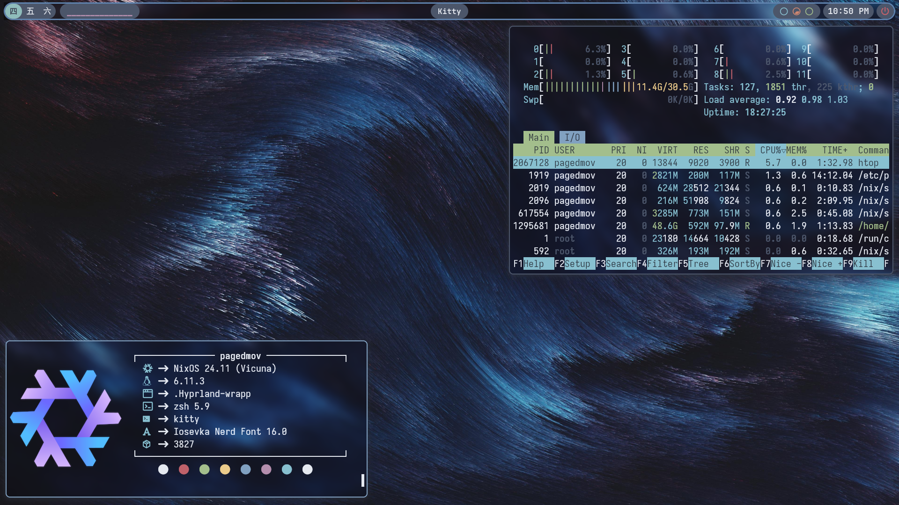

# ❄️ pagedMov's NixOS dots ❄️
Take whatever you like, just know that the hardware configurations in my hosts folder won't work on your machine : )

My dots are written 100% in Nix so if you bring your own hardware-configuration.nix, these should work on any machine out of the box.

If you are on NixOS and have flakes enabled, you can just clone the repo and run sudo nixos-rebuild switch --flake /path/to/this-repo (again, just make sure you don't use my hardware configuration on your machine)

