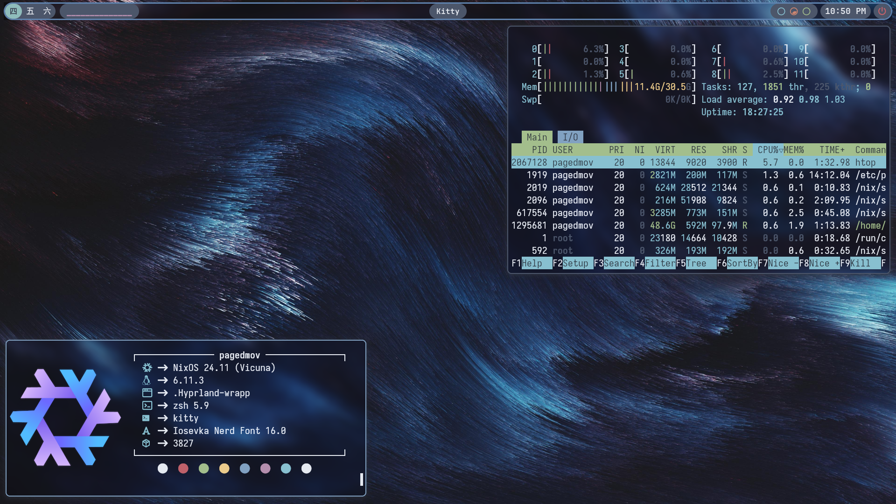

# ❄️ pagedMov's NixOS dots ❄️
Take whatever you like, just know that the hardware configurations in my hosts folder won't work on your machine : )

My dots are written 100% in Nix so if you bring your own hardware-configuration.nix, these should work on any machine out of the box.

If you are on NixOS and have flakes enabled, you can just clone the repo and run sudo nixos-rebuild switch --flake /path/to/this-repo (again, just make sure you don't use my hardware configuration on your machine)

## Neat Features
* *chscheme* - This script will open a fuzzy finder window containing all of the colorschemes available in the base16-schemes package on nixpkgs. It contains a preview showing you what the colors will look like in your terminal.

Important note: Some aspects of the configuration are hard coded. these include
* Hyprland config: hardcoded display outputs
* Waybar config: hardcoded display outputs
* Git config: set up like userEmail = ${username}@gmail.com, userName = ${username}, so these will be substituted with whatever you put as the username in the flake.nix file.
