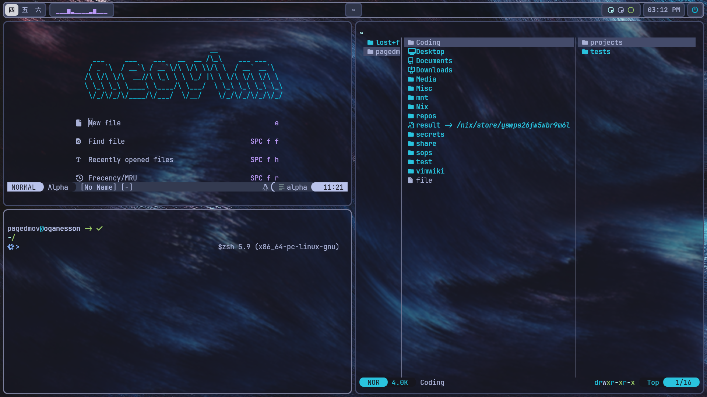

# ❄️ pagedMov's NixOS dots ❄️

Special thanks to Frost-Phoenix, this config started out as a fork of his dots. [Check out his
config here](https://github.com/Frost-Phoenix/nixos-config/tree/catppuccin)

Take whatever you like, just know that the hardware configurations in my hosts folder won't work on your machine : )

My dots are written 100% in Nix so if you bring your own hardware-configuration.nix, these should work on any machine out of the box.

If you are on NixOS and have flakes enabled, you can just clone the repo and run sudo nixos-rebuild switch --flake /path/to/this-repo (again, just make sure you don't use my hardware configuration on your machine)





## Programs

| Component      | Program                                           |
|----------------|---------------------------------------------------|
| Window manager | [Hyprland](https://github.com/hyprwm/Hyprland)    |
| Status Bar     | [Waybar](https://github.com/Alexays/Waybar)       |
| Launcher       | [Fuzzel](https://codeberg.org/dnkl/fuzzel)        |
| Terminal       | [Kitty](https://github.com/kovidgoyal/kitty)      |
| Shell          | [zsh](https://zsh.sourceforge.io/)                |
| Text Editor    | [Nixvim](https://github.com/nix-community/nixvim) |
| Image Viewer   | [feh](https://github.com/derf/feh)                |

## Scripts

```chpaper``` - opens a fzf window with filenames and previews of images in $FLAKEPATH/assets/wallpapers. Picking one replaces the existing wallpaper path in $FLAKEPATH/flake.nix with the one you chose.

```chscheme``` - opens the full list of base16 color schemes in a fzf window, with a preview to see how the colors look in your terminal. When selected, replaces the chosen colorscheme in $FLAKEPATH/flake.nix with the on you chose.

```keyring``` - opens a fzf window containing all of the paths in ~/.password-store. Selecting one will use pass to copy the corresponding password to your clipboard for up to 45 seconds.

```toolbelt``` - opens a fzf menu containing some utilities that are nice to have in arm's reach; btop, alsamixer, the chpaper and chscheme scripts, among others. Bound to Super + P in the hyprland config by default.

```viconf``` - takes a partial path or filename as an argument. Attempts to find a corresponding .nix file or directory in $FLAKEPATH. If multiple matches are found, then it opens a fzf instance that allows you to choose one. Opens the file in neovim.

## Aliases

```rebuild``` == ```nh os switch```

```ga``` == ```git add```

```gcomm``` == ```git commit```

```gpull``` == ```git pull```

```gpush``` == ```git push```

```gt``` == ```gtrash```

```gtp``` == ```gtrash put```

```svc``` == ```sudo systemctl```

```svcu``` == ```systemctl --user```

```viflake``` == ```nvim flake.nix```

```pk``` == ```pkill -9 -f```

```psg``` == ```ps aux | grep -v grep | grep -i -e VSZ -e```

```sr``` == ```source ~/.zshrc```

## Bindings
'mod' is Super by default.
<details>
    <summary>Utility</summary>
    ```mod + printscreen``` = grimblast copy area

    ```mod + t``` = open swaync-client

    ```mod + a``` = open firefox

    ```mod + q``` = open kitty

    ```mod + c``` = kill active window

    ```mod + e``` = open nemo (file browser)

    ```mod + p``` = open toolbelt script window

    ```mod + m``` = open fuzzel (application launcher)

    ```mod + r``` = open neovide (neovim GUI)

</details>
<details>
    <summary>Navigation</summary>
    ```super + b``` = togglesplit, # dwindle

    ```super + f``` = togglefloating

    ```super + g``` = fullscreen

    ```super + h``` = movefocus, l

    ```super + l``` = movefocus, r

    ```super + k``` = movefocus, u

    ```super + j``` = movefocus, d

    ```super + d``` = exec, switchmon

    ```super + 1``` = go to workspace 1

    ```super + 2``` = go to workspace 2

    ```super + 3``` = go to workspace 3

    ```super + 4``` = go to workspace 4

    ```super + 5``` = go to workspace 5

    ```super + 6``` = go to workspace 6

    ```super + shift + 1``` = movetoworkspace, 1

    ```super + shift + 2``` = movetoworkspace, 2

    ```super + shift + 3``` = movetoworkspace, 3

    ```super + shift + 4``` = movetoworkspace, 4

    ```super + shift + 5``` = movetoworkspace, 5

    ```super + shift + 6``` = movetoworkspace, 6

    ```super + s``` = togglespecialworkspace, magic

    ```super + shift + s``` = movetoworkspace, special:magic

</details>

---

Important note: Some aspects of the configuration are hard coded. these include
* Hyprland config: hardcoded display outputs
* Waybar config: hardcoded display outputs
* Git config: set up like userEmail = ${username}@gmail.com, userName = ${username}, so these will be substituted with whatever you put as the username in the flake.nix file.
